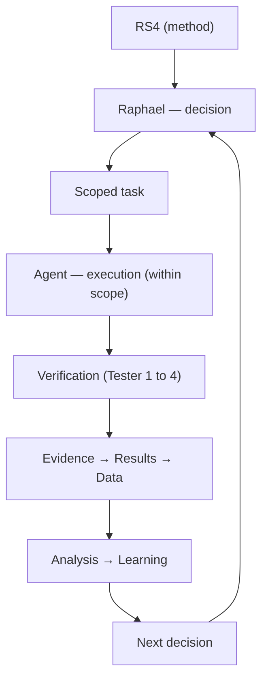

<div align="center">


# 🧪 RS4 Lab

**Rs4Machine's Experimental Lab**

[](LICENSE)


[🇧🇷 Português](README.pt-BR.md) · **🇺🇸 English (this file)**

> Experiment first. Measure. Understand. Only then scale.

</div>

---

## 📑 Table of Contents

- [What is RS4 Lab](#-what-is-rs4-lab)
- [Principles](#-principles)
- [Current Structure](#️-current-structure)
- [Experiments](#-experiments)
- [Working Model](#-working-model)
- [Verification Layers](#-verification-layers)
- [About Agents](#-about-agents)
- [Capital Side (Future)](#-capital-side-future)
- [Status](#-status)
- [Author](#-author)

---

## 🎯 What is RS4 Lab

RS4 Lab is a space for controlled experimentation in intelligent systems, AI agents, and software engineering.

It's not a startup.
It's not an agent playground.
It's a lab with a method.

Here we log hypotheses, run small experiments, collect evidence, and decide based on data — always keeping a human as the final decision-maker.

---

## 🧭 Principles

1. A human remains the final decision-maker and is accountable for the outcome.
2. Every autonomous system must have a clear, fast, and documented way to be interrupted.
3. Critical decisions are never fully delegated to agents.
4. Understanding and the ability to debug can never be outsourced.
5. Contingency plans are part of the method, not optional.
6. The greater a task's potential impact, the greater the level of supervision and restriction must be.

---

## 🏗️ Current Structure

```
experiments/
├── 001-architecture-first
├── 002-pipeline-validation
├── 003-Agent-Assisted
└── 004-local-triage-automation

metrics/
docs/
```

Each experiment has its own documentation, evidence, and metrics as needed.

---

## 🔬 Experiments

| # | Name | Status | Started |
|---|---|---|---|
| 001 | Architecture First | Completed | Aug/2026 |
| 002 | Pipeline Validation | Completed | Aug/2026 |
| 003 | Agent-Assisted Development | Hypothesis under evaluation | 08/22/2026 |
| 004 | Local Triage Automation | Under experimentation | Aug/2026 |

### Experiment-003 — Agent-Assisted Development

First experiments with agents acting as operators within scoped tasks.

The goal is to observe execution capability, the need for human intervention, output quality, and the relationship between autonomy and supervision.

### Experiment-004 — Local Triage Automation

Experiment focused on evaluating local models on a file-triage task.

The experiment uses a human baseline as a reference and logs time and quality metrics to compare models.

First recorded batch with:

- Llama 3.2 3B
- Qwen 2.5 3B

Results are still experimental and do not represent a conclusion about automation's superiority.

---

## 🔁 Working Model



---

## ✅ Verification Layers

| Tester | Role |
|---|---|
| **Tester 1** | Machine (automated tests) |
| **Tester 2** | Verifier agent |
| **Tester 3** | Measurement (metrics) |
| **Tester 4** | Human (0–3 understanding scale) |

---

## 🤖 About Agents

Agents execute within their delegated scope.

**They can:**

- Write, review, and test code
- Generate documentation
- Collect and organize data
- Produce proposals

**They cannot:**

- Set the project's direction
- Approve critical changes
- Replace human understanding
- Push relevant changes to production on their own

---

## 💰 Capital Side (Future)

The technical lab and the operational (capital) side move together, but at different paces.

While the Lab validates methods and quality, the capital side will explore ways to generate revenue at near-zero cost (affiliates, templates, automations, etc.).

Capital exists to provide stability and the conditions to keep the work going. It is not the primary goal.

---

## 🚧 Status

**Under construction.**

Experiments started in August 2026. The lab is currently moving from initial documentation to comparative experiments with metrics.

---

## 👤 Author

**Raphael Mendes**
Rs4Machine | AI Research Lab

> *"Technology can expand our capability. It should not replace our responsibility."*
