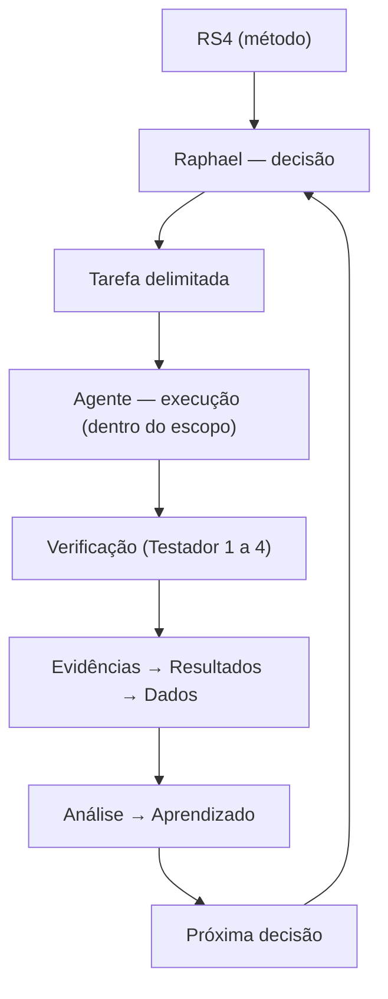

<div align="center">


# 🧪 RS4 Lab

**Laboratório de Engenharia de Sistemas de IA · Rs4Machine**

[](LICENSE)


**🇧🇷 Português (este arquivo)** · [🇺🇸 English](README.md)

> Experimentar primeiro. Medir. Compreender. Somente então escalar.

</div>

---

## 📑 Sumário

- [O que é o RS4 Lab](#-o-que-é-o-rs4-lab)
- [Princípios](#-princípios)
- [Estrutura Atual](#-estrutura-atual)
- [Índice de Experimentos](#-índice-de-experimentos)
- [Modelo de Trabalho](#-modelo-de-trabalho)
- [Camadas de Verificação](#-camadas-de-verificação)
- [Sobre Agentes](#-sobre-agentes)
- [Status](#-status)
- [Autor](#-autor)

---

## 🎯 O que é o RS4 Lab

O **RS4 Lab** é o laboratório experimental da **Rs4Machine**. É um ambiente controlado para testar sistemas inteligentes, agentes de IA e métodos de engenharia orientados à produção sob restrições reais.

Não é uma corrida de startup. Não é um playground de agentes sem limites. É um laboratório com método.

O objetivo é validar hipóteses com evidência, medir o comportamento real e manter o humano responsável por decisões críticas.

---

## 🧭 Princípios

> Experimentar primeiro. Medir. Compreender. Somente então escalar.

- Um humano permanece como decisor final em toda chamada crítica.
- Todo sistema autônomo precisa de uma forma clara e rápida de ser interrompido.
- Decisões guiadas por métricas, não por intuição.

1. O humano permanece como decisor final e responsável pelo resultado.
2. Todo sistema autônomo deve ter uma forma clara, rápida e documentada de ser interrompido.
3. Decisões críticas nunca são delegadas completamente a agentes.
4. Compreensão e capacidade de depuração não podem ser terceirizadas.
5. Planos de contingência fazem parte do método, não são opcionais.
6. Quanto maior o impacto potencial de uma tarefa, maior deve ser o nível de supervisão e restrição.

---

## 🏗️ Estrutura Atual

```text
experiments/
├── 001-architeture-first
├── 002-pipeline-validation
├── 003-agent-assisted
├── 004-local-triage-automation
├── 005-ai-system-improvement
│   └── 001-sofiavoice
├── 006-cortex-flow
│
metrics/
docs/
```

Cada experimento documenta sua hipótese, evidência e critérios de avaliação conforme a necessidade.

---

## 🧪 Índice de Experimentos

Índice geral dos experimentos ativos do laboratório. Cada entrada aponta apenas para o README principal do experimento; métricas detalhadas e notas de execução ficam dentro da pasta de cada experimento.

| # | Experimento | Status | README principal |
|---|---|---|---|
| 004 | Local Triage Automation | Em experimentação | [Ler experimento](./experiments/004-local-triage-automation/experiment-001/README.md) |
| 005 | AI System Improvement — SofiaVoice v2.0 | Publicado | [Ler experimento](./experiments/005-ai-system-improvement/001-sofiavoice/README.md) |
| 006 | Cortex Flow | Em experimentação | [Ler experimento](./experiments/006-cortex-flow/README.md) |

---

## 🔁 Modelo de Trabalho



---

## ✅ Camadas de Verificação

| Testador | Papel |
|---|---|
| **Testador 1** | Máquina (testes automatizados) |
| **Testador 2** | Agente verificador |
| **Testador 3** | Medição (métricas) |
| **Testador 4** | Humano (escala de entendimento 0–3) |

---

## 🤖 Sobre Agentes

Os agentes executam dentro do escopo delegado.

**Eles podem:**

- Escrever, revisar e testar código
- Gerar documentação
- Coletar e organizar dados
- Produzir propostas

**Eles não podem:**

- Definir a direção do projeto
- Aprovar alterações críticas
- Substituir o entendimento humano
- Publicar alterações relevantes em produção sozinhos

---

## 🚧 Status

**Em construção.**

Os experimentos iniciaram em agosto de 2026. O laboratório está avançando da documentação inicial para experimentos comparativos com métricas e evidências rastreáveis.

---

## 👤 Autor

**Raphael Mendes**

**AI Systems Engineer & Founder · Rs4Machine**

> "A tecnologia pode ampliar nossa capacidade. Ela não deve substituir nossa responsabilidade."

